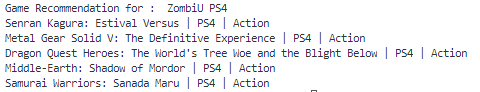

# Game Recommendation using Cosine Similarity

Dataset source: https://www.kaggle.com/rush4ratio/video-game-sales-with-ratings

This is a simple Content Based Filtering - Game Recommendation System using a simple similarity-based method based on genre, platform and game of users preferences.

 
